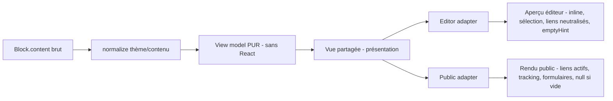
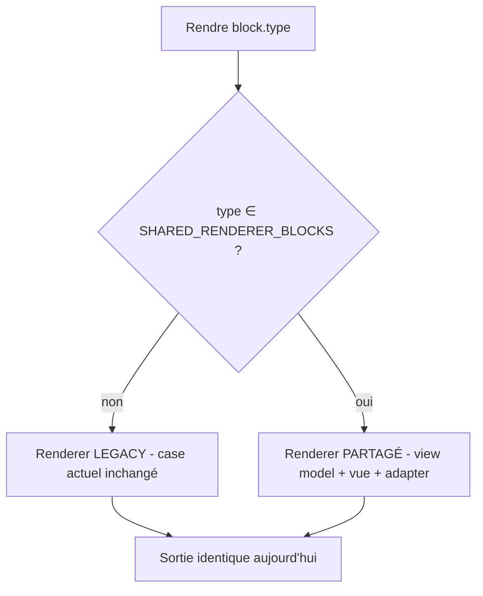

# Architecture du renderer partagé (moteur de rendu unifié des blocs)

Mission **B09.1** — conception uniquement. Aucun bloc migré, aucun rendu modifié, aucun
flag activé. Ce document définit la cible ; l'implémentation inerte + les 3 pilotes viendront
en B09.2.

## 1. Contexte & problème

Deux moteurs rendent les **142 blocs** :

- `apps/web/src/app/dashboard/builder/builderPreview.tsx` (2666 l.) — aperçu **éditeur**.
- `apps/web/src/app/[slug]/PublicPageClient.tsx` (3084 l.) — rendu **public**.

Chaque bloc est écrit **deux fois** → divergences de champs, de limites, d'états vides, de
CTA (cf. B01–B08). Toute correction doit être faite en double.

## 2. Objectifs / non-objectifs

**Objectifs** : partager la logique sémantique (modèles de vue), permettre une structure
visuelle partagée quand c'est sûr, isoler ce qui est propre au contexte, migrer **bloc par
bloc** avec l'ancien système toujours actif, rollback trivial, zéro changement de données.

**Non-objectifs** (missions séparées) : un composant géant `isEditor`, corriger les
divergences connues, changer le visuel, migrer plusieurs blocs à la fois, refondre les
formulaires ou le tracking.

## 3. Matrice de partage (responsabilités)

| Responsabilité | Éditeur | Public | Partageable | Reste spécifique |
| --- | --- | --- | --- | --- |
| Préparation/normalisation des données | oui | oui | **OUI** (view model pur) | — |
| Filtres d'items / limites | oui | oui | **OUI** (view model) | — |
| Valeurs par défaut / fallbacks | oui | oui | **OUI** (view model) | — |
| Détection « vide » | oui | oui | **OUI** (`hasPublishableContent`) | — |
| Couleurs / typo (thème) | oui | oui | **OUI** (`normalizePageTheme`) | — |
| Normalisation d'URL | partiel | oui | **OUI** (`extHref`) | — |
| Structure visuelle (layout/hiérarchie) | oui | oui | **OUI si parité** (vue partagée) | échelle |
| Édition inline (`InlineEditable`) | 29× | non | non | **éditeur** |
| Sélection / overlays / drag | oui | non | non | **éditeur** |
| Rendu de l'état vide (`emptyHint`) | oui | `null` | logique partagée, rendu spécifique | **contexte** |
| Liens navigables | non (neutralisés) | oui | contrat commun | **adapter** |
| Tracking (`trackLinkClick` 87×, impressions) | non | oui | non | **public** |
| Formulaires (`LeadFormPublic` + `submitLead`) | preview | soumission | vue possible | **adapter** |
| Sécurité runtime / RLS | non | oui | non | **public** |

## 4. Architecture cible — flux



Le **view model** décide TOUT ce qui est sémantique (visibilité, items, libellés, URLs
sûres, limites). La **vue** ne fait que présenter. Les **adapters** injectent le
comportement propre au contexte.

## 5. Résolution d'un renderer (legacy ↔ shared)



Par défaut : **legacy**. Un bloc ne passe en partagé que s'il est ajouté au set (flag) après
avoir coché la Definition of Done. **Rollback = retirer le type du set** (aucune donnée touchée).

## 6. Arborescence cible

```text
apps/web/src/app/dashboard/builder/shared-renderer/
  architecture.ts            # types/contrats/flag inertes (B09.1)
  registry.ts                # registre + résolution legacy/shared (B09.2)
  models/                    # view models PURS (sans React) — testables
    heading.ts
    values.ts
    pricing.ts               # réutilise pricingCtaModel
  views/                     # vues partagées (React, sans dépendance dashboard/supabase)
    HeadingView.tsx
    RepeaterView.tsx
  primitives/                # BlockContainer, BlockTitle, BlockCta, BlockEmptyState
  adapters/
    editor/                  # inline, sélection, liens neutralisés
    public/                  # liens actifs + tracking, formulaires
  blocks/                    # branchement par bloc (model + view + adapters + test)
    heading/  values/  pricing/
```

Règles : pas de barrel géant (imports involontaires), `models/` sans React (tree-shaking +
réutilisables serveur), `views/` sans import `dashboard`/`supabase`, adapters éditeur jamais
importés dans le bundle public.

## 7. Types & contextes (voir `architecture.ts`)

- `RenderMode = "editor" | "public"`.
- `RendererMigrationStatus = "legacy" | "pilot" | "shared"`.
- `SharedBlockContext` = { pageId, blockId, theme, mode }.
- `EditorBlockContext` = shared + { selected, locked, compact, onSelect, onEdit?, InlineEdit }.
- `PublicBlockContext` = shared + { ownerEmail?, tracking, LinkRenderer }.
- **Capacités** plutôt que 50 callbacks optionnels : `LinkRenderer`, `TrackingCapability`,
  `InlineEditCapability` injectés par l'adapter.

## 8. Registre

`BlockRendererRegistration<TContent, TViewModel>` = { type, status, createViewModel(pur),
SharedView?, EditorAdapter?, PublicAdapter? }. Le registre : donne le statut, sélectionne
legacy par défaut, permet un bloc pilote, teste la présence des adapters, produit un rapport.
**Bundle** : imports directs pour les rares pilotes ; si le catalogue grossit, code-splitting
par catégorie / maps séparées éditeur-public (les adapters éditeur ne doivent jamais entrer
dans le bundle public).

## 9. Niveaux de partage

| Niveau | Nom | Ce qui est partagé |
| --- | --- | --- |
| 0 | Legacy | rien (2 renderers) |
| 1 | View model | transformation commune, vues séparées |
| 2 | Structure | vue commune + adapters de comportement |
| 3 | Complet | même vue, contexte injecté |

## 10. Matrice de décision du niveau

| Caractéristique | Niveau |
| --- | --- |
| Texte statique / titre | 3 |
| CTA sans tracking complexe | 3 |
| Liste filtrée (répéteur) | 2 ou 3 |
| Formulaire | 1 ou 2 |
| Embed tiers | 1 |
| Tracking complexe | 1 ou 2 |
| Différence visuelle forte éditeur/public | 1 |
| Divergence fonctionnelle connue | **0 jusqu'à correction** |

## 11. Liens — adapter

Pas de booléen `disableLink`. Une **capacité** `LinkRenderer` injectée :
- éditeur → rend un élément **non navigable** (`aria-disabled`, sélectionne le bloc, tooltip
  « lien actif sur la page publiée ») ;
- public → `<a>` avec `href` sûr (`extHref`), `target`/`rel` corrects, `trackLinkClick`.
La vue partagée appelle `context.Link({ href, label })` sans savoir lequel.

## 12. Formulaires

Vue commune possible (titre, champs, bouton, styles). **Jamais de soumission depuis
l'éditeur.** Adapter éditeur = preview neutralisé ; adapter public = `LeadFormPublic`
(validation, honeypot, `submitLead`, états async). Décision : `LeadFormPublic` **reste
autonome** et devient l'adapter public des blocs formulaire (ne pas le réécrire). Famille
formulaire = niveau 1–2, vague tardive.

## 13. États vides

- **Vide sémantique** : décidé par le view model (`visible === false`), partagé
  (`hasPublishableContent`).
- **Rendu du vide** : contextuel — éditeur `BlockEmptyState`/`emptyHint` (+ mention
  « invisible en ligne »), public `null`.

## 14. Tracking

Isolé via capacité `TrackingCapability` (onLinkClick, onImpression). **Aucun tracking dans
l'éditeur** ; échec non bloquant ; données minimales ; **jamais** de dépendance analytics
dans les models purs.

## 15. Médias

URL normalisée dans le **view model** (`extHref`/helpers embed) ; comportement d'asset
invalide décidé dans le model (fallback) ; placeholder éditeur vs lazy-load public dans les
adapters ; embeds tiers = niveau 1 (vue spécifique au début, sécurité des iframes côté public).

## 16. Styles — parité sans changement visuel

- **Option A** (structure identique, scaling externe éditeur) → familles simples (texte, cta).
- **Option B** (structure partagée + variantes `density`) → répéteurs/cartes.
- **Option C** (view model seul, rendu encore séparé) → embeds/formulaires au début.
Phase 1 = **reproduire à l'identique** (parité), simplification/tokens en missions séparées.

## 17. Performance & bundle

Models purs dans fichiers **sans React** ; vues sans dépendance `dashboard`/`supabase` ;
adapters éditeur exclus du bundle public ; exports explicites (pas de barrel géant) ;
`memo` seulement si mesuré ; lazy par catégorie si le catalogue partagé grossit. Garde-fou :
un test vérifie qu'aucun symbole éditeur (`InlineEditable`, etc.) n'est importé par le chemin
public.

## 18. Accessibilité & sécurité

- **Vue partagée** : structure sémantique, labels, alt, hiérarchie.
- **Adapter éditeur** : `aria-disabled` sur liens, focus d'édition, pas de lien vide.
- **Adapter public** : bouton/lien réel, `aria-live` (succès/erreur), focus visiteur.
- **Sécurité** : models purs = nettoyage/filtrage ; adapters publics = liens sûrs, routes
  serveur, jamais de confiance aux IDs client ; vues partagées = jamais de secret / client
  service-role / RLS / HTML arbitraire non sanitizé.

## 19. Migration progressive — vagues

1. Atomes/texte (divider, spacer, heading, rich_text…) — N3, risque faible.
2. CTA & cartes simples (cta_button, *_button, profile) — N3, standard.
3. Répéteurs simples (values, faq, timeline, team, stats_block…) — N2/3.
4. Commerce (pricing, product, packs…) — N2.
5. Événement (event_program, lineup, countdown…) — N2.
6. Médias & musique (gallery, embeds, spotify…) — N1/2, élevé.
7. Formulaires (contact_form, rsvp, quote_form…) — N1/2.
8. Complexes & QR (qr_code_block) — mission dédiée.

Détail par bloc : `docs/SHARED-RENDERER-MIGRATION-MATRIX.md`.

## 20. Tests futurs (garde-fous)

Registre (type unique, statut valide, adapters requis pour `shared`, legacy par défaut) ;
models (vide/minimal/complet/invalide/limites/URL) ; parité (visibilité/items/liens/vide) ;
migration (legacy avant activation, shared après, rollback, **même view model éditeur/public**,
aucune mutation de données) ; bundle (pas d'import éditeur dans le public).

## 21. Rollback

Retirer le type de `SHARED_RENDERER_BLOCKS` → retour legacy immédiat, **aucune donnée
touchée**, legacy toujours présent. Activation future : période de coexistence + validation
visuelle + observation des erreurs AVANT suppression du legacy (mission ultérieure).

## 22. Roadmap

B09.2 = infra inerte + registre + 3 pilotes (heading, values, pricing) derrière flag, non
activés en prod. Puis vagues 1→8. La Definition of Done (`docs/RENDERER-DOD.md`) conditionne
chaque activation.
